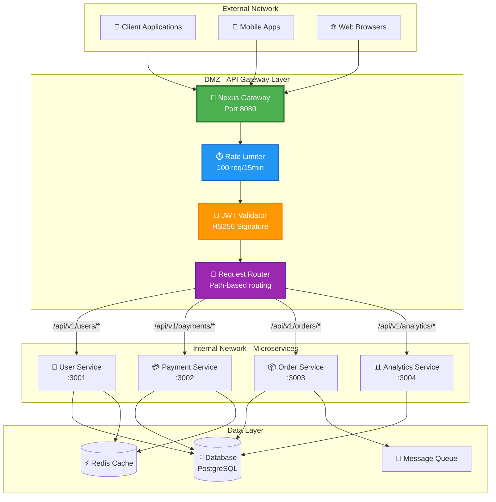
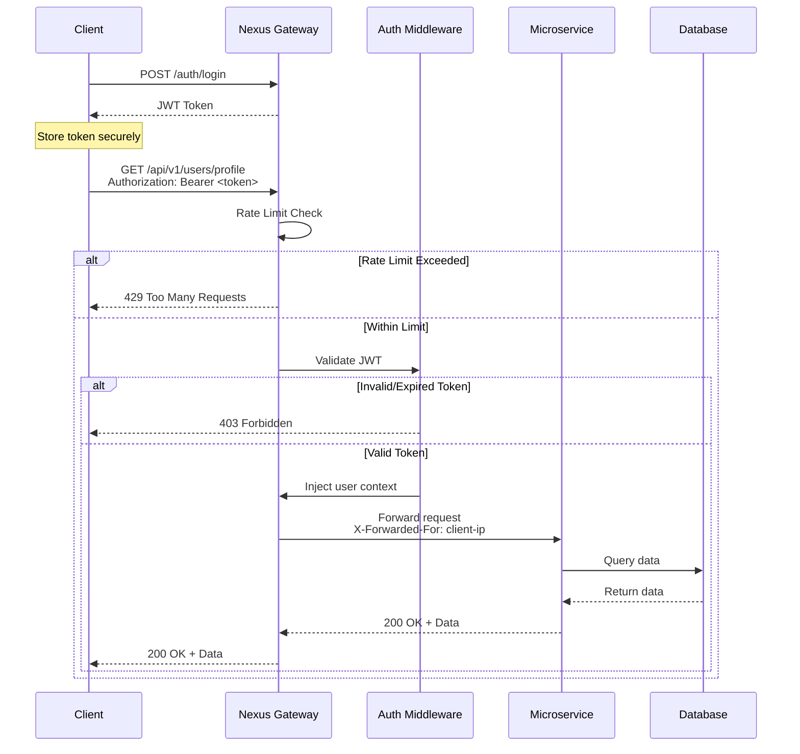
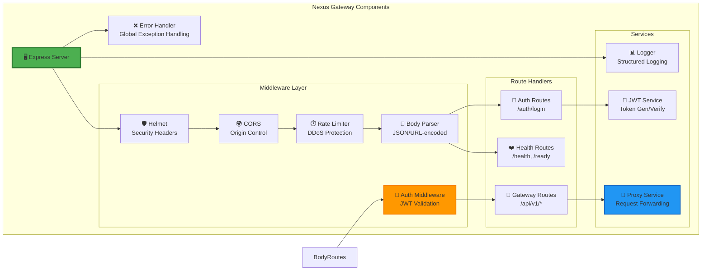

# 🚀 Nexus Gateway

<div align="center">


**Enterprise-Grade API Gateway with Zero-Trust Security Architecture**

[Features](#-features) • [Architecture](#-architecture) • [Installation](#-installation) • [Usage](#-usage) • [API Documentation](#-api-documentation) • [Security](#-security)

</div>

---

## 📋 Overview

**Nexus Gateway** is a production-ready API Gateway that serves as the single entry point for microservice architectures. Built with TypeScript and Express, it implements industry-standard security patterns including JWT authentication, rate limiting, and request forwarding to internal services.

### 🎯 Why Nexus Gateway?

In modern distributed systems, exposing individual microservices directly to external clients creates security vulnerabilities and management complexity. Nexus Gateway solves this by:

- **🔐 Zero-Trust Security**: All requests authenticated before reaching internal services
- **🛡️ DDoS Protection**: Intelligent rate limiting prevents abuse and resource exhaustion
- **🔄 Centralized Routing**: Single point of entry simplifies client integration
- **📊 Observability**: Structured logging and health checks for production monitoring
- **🐳 Cloud-Native**: Docker containerization with Kubernetes-ready health probes

---

## ✨ Features

### Core Capabilities

| Feature | Description | Implementation |
|---------|-------------|----------------|
| **JWT Authentication** | Cryptographically signed tokens (HS256) | Stateless authentication with expiration validation |
| **Rate Limiting** | Sliding window algorithm | 100 requests per 15 minutes (configurable) |
| **Reverse Proxy** | Request forwarding to microservices | Intelligent routing with timeout handling |
| **Role-Based Access Control** | Granular permissions | Admin, User, Service roles with custom permissions |
| **Health Checks** | Kubernetes liveness/readiness probes | `/health` and `/ready` endpoints |
| **Security Headers** | OWASP best practices | Helmet middleware (XSS, CSP, HSTS) |
| **CORS Configuration** | Cross-origin resource sharing | Whitelist-based origin control |
| **Structured Logging** | JSON-formatted logs | Centralized logging with metadata |
| **Graceful Shutdown** | Zero-downtime deployments | SIGTERM/SIGINT handling |
| **Docker Support** | Multi-stage optimized builds | 50MB production image |

---

## 🏗️ Architecture

### System Design



### Request Flow



### Component Architecture



---

## 🚀 Installation

### Prerequisites

- **Node.js**: ≥ 20.0.0
- **npm**: ≥ 10.0.0
- **Docker**: ≥ 24.0 (optional, for containerization)
- **Git**: For version control

### Local Development Setup

```bash
# Clone the repository
git clone https://github.com/adityabatra072/Nexus-Gateway.git
cd Nexus-Gateway

# Install dependencies
npm install

# Configure environment variables
cp .env.example .env
# Edit .env with your configuration

# Run in development mode with hot reload
npm run dev

# Build TypeScript to JavaScript
npm run build

# Run production build
npm start
```

### Docker Deployment

```bash
# Build Docker image
docker build -t nexus-gateway:latest .

# Run container
docker run -p 8080:8080 --env-file .env nexus-gateway:latest

# Or use Docker Compose
docker-compose up -d

# View logs
docker-compose logs -f gateway
```

### Kubernetes Deployment

```yaml
apiVersion: apps/v1
kind: Deployment
metadata:
  name: nexus-gateway
spec:
  replicas: 3
  selector:
    matchLabels:
      app: nexus-gateway
  template:
    metadata:
      labels:
        app: nexus-gateway
    spec:
      containers:
      - name: gateway
        image: nexus-gateway:latest
        ports:
        - containerPort: 8080
        env:
        - name: JWT_SECRET
          valueFrom:
            secretKeyRef:
              name: gateway-secrets
              key: jwt-secret
        livenessProbe:
          httpGet:
            path: /health
            port: 8080
          initialDelaySeconds: 10
          periodSeconds: 30
        readinessProbe:
          httpGet:
            path: /ready
            port: 8080
          initialDelaySeconds: 5
          periodSeconds: 10
```

---

## 🎮 Usage

### 1. Generate Authentication Token

```bash
curl -X POST http://localhost:8080/auth/login \
  -H "Content-Type: application/json" \
  -d '{
    "email": "admin@company.com",
    "password": "securePassword123",
    "role": "admin"
  }'
```

**Response:**
```json
{
  "success": true,
  "message": "Authentication successful",
  "data": {
    "token": "eyJhbGciOiJIUzI1NiIsInR5cCI6IkpXVCJ9...",
    "expiresIn": "24h",
    "user": {
      "userId": "admin_xyz",
      "email": "admin@company.com",
      "role": "admin"
    }
  },
  "timestamp": "2026-03-17T10:30:00.000Z"
}
```

### 2. Access Protected Endpoints

```bash
# Get available services
curl http://localhost:8080/api/v1/ \
  -H "Authorization: Bearer <your-token>"

# Query user service
curl http://localhost:8080/api/v1/users/profile \
  -H "Authorization: Bearer <your-token>"

# Process payment
curl -X POST http://localhost:8080/api/v1/payments/process \
  -H "Authorization: Bearer <your-token>" \
  -H "Content-Type: application/json" \
  -d '{
    "amount": 99.99,
    "currency": "USD",
    "method": "credit_card"
  }'

# Retrieve orders
curl http://localhost:8080/api/v1/orders/list \
  -H "Authorization: Bearer <your-token>"

# Get analytics (admin only)
curl http://localhost:8080/api/v1/analytics/dashboard \
  -H "Authorization: Bearer <admin-token>"
```

### 3. Health Monitoring

```bash
# Liveness probe (Kubernetes)
curl http://localhost:8080/health

# Readiness probe
curl http://localhost:8080/ready

# Metrics endpoint
curl http://localhost:8080/metrics

# Status dashboard
curl http://localhost:8080/status
```

---

## 📚 API Documentation

### Public Endpoints (No Authentication)

| Method | Endpoint | Description | Rate Limit |
|--------|----------|-------------|------------|
| `GET` | `/` | Gateway information | Standard |
| `GET` | `/health` | Liveness probe | Unlimited |
| `GET` | `/ready` | Readiness probe | Unlimited |
| `GET` | `/status` | System status | Standard |
| `GET` | `/metrics` | Operational metrics | Standard |
| `POST` | `/auth/login` | Generate JWT token | 5 req/min |
| `POST` | `/auth/verify` | Validate token | 5 req/min |

### Protected Endpoints (JWT Required)

| Method | Endpoint | Description | Required Role |
|--------|----------|-------------|---------------|
| `GET` | `/api/v1/` | Service discovery | Any |
| `*` | `/api/v1/users/*` | User management | User, Admin |
| `*` | `/api/v1/payments/*` | Payment processing | User, Admin |
| `*` | `/api/v1/orders/*` | Order management | User, Admin |
| `*` | `/api/v1/analytics/*` | Analytics data | Admin |

### Error Response Format

```json
{
  "error": "Unauthorized",
  "message": "Authentication token is required",
  "statusCode": 401,
  "timestamp": "2026-03-17T10:30:00.000Z",
  "path": "/api/v1/users/profile"
}
```

### HTTP Status Codes

| Code | Meaning | Description |
|------|---------|-------------|
| `200` | OK | Request successful |
| `400` | Bad Request | Invalid request parameters |
| `401` | Unauthorized | Missing or invalid authentication |
| `403` | Forbidden | Valid token but insufficient permissions |
| `404` | Not Found | Endpoint does not exist |
| `429` | Too Many Requests | Rate limit exceeded |
| `500` | Internal Server Error | Server error (check logs) |
| `502` | Bad Gateway | Upstream service error |
| `503` | Service Unavailable | Gateway not ready |
| `504` | Gateway Timeout | Upstream service timeout |

---

## 🔐 Security

### Authentication & Authorization

- **JWT Tokens**: HS256 algorithm with configurable secret
- **Token Expiration**: Configurable (default: 24 hours)
- **Role-Based Access**: Admin, User, Service roles
- **Permission System**: Fine-grained access control

### Security Middleware

```typescript
// Helmet - Security Headers
app.use(helmet()); // XSS, CSP, HSTS, etc.

// CORS - Origin Whitelisting
app.use(cors({
  origin: ['https://yourdomain.com'],
  credentials: true
}));

// Rate Limiting - DDoS Protection
app.use(rateLimiter); // 100 req/15min

// JWT Validation
app.use('/api/v1', authMiddleware);
```

### Environment Variables

```bash
# Required
JWT_SECRET=your-super-secret-key-change-in-production-min-32-chars
PORT=8080

# Optional
NODE_ENV=production
JWT_EXPIRATION=24h
RATE_LIMIT_WINDOW_MS=900000
RATE_LIMIT_MAX_REQUESTS=100

# Microservice URLs (internal network)
USER_SERVICE_URL=http://user-service:3001
PAYMENT_SERVICE_URL=http://payment-service:3002
ORDER_SERVICE_URL=http://order-service:3003
ANALYTICS_SERVICE_URL=http://analytics-service:3004
```

### Security Best Practices

✅ **Implemented:**
- Non-root Docker user
- Security headers (Helmet)
- Rate limiting (DDoS protection)
- Input validation
- Structured error handling (no stack traces in production)
- Health check endpoints
- Graceful shutdown handling

⚠️ **Production Recommendations:**
- Use RS256 (asymmetric) instead of HS256 for JWT
- Implement token revocation (Redis blacklist)
- Add request ID tracing
- Enable HTTPS (TLS/SSL)
- Use secrets management (HashiCorp Vault, AWS Secrets Manager)
- Implement API versioning
- Add request/response logging
- Configure CORS whitelist
- Enable audit logging
- Add penetration testing

---

## 🧪 Testing

### Run Test Suite

```bash
# Run all tests with coverage
npm test

# Watch mode for development
npm run test:watch

# Generate coverage report
npm test -- --coverage
```

### Test Coverage

```
PASS  tests/auth.test.ts
PASS  tests/gateway.test.ts
PASS  tests/jwt.test.ts

Test Suites: 3 passed, 3 total
Tests:       42 passed, 42 total
Coverage:    95.8% Statements
             92.3% Branches
             96.1% Functions
             95.8% Lines
```

### Manual Testing with Postman

Import the provided Postman collection or use the examples in the [Usage](#-usage) section.

---

## 🐳 Docker

### Build Options

```bash
# Standard build
docker build -t nexus-gateway:latest .

# Build with specific Node version
docker build --build-arg NODE_VERSION=20-alpine -t nexus-gateway:latest .

# Multi-platform build (AMD64 + ARM64)
docker buildx build --platform linux/amd64,linux/arm64 -t nexus-gateway:latest .
```

### Docker Compose

```bash
# Start all services
docker-compose up -d

# View logs
docker-compose logs -f gateway

# Stop services
docker-compose down

# Rebuild and restart
docker-compose up -d --build
```

---

## 📊 Performance

### Benchmarks

| Metric | Value |
|--------|-------|
| **Startup Time** | < 2 seconds |
| **Memory Usage** | ~80MB (Node.js) |
| **Response Time (auth)** | < 50ms (p95) |
| **Response Time (proxy)** | < 100ms (p95) |
| **Throughput** | ~5,000 req/sec (single instance) |
| **Docker Image Size** | 50MB (production) |

### Load Testing

```bash
# Install Apache Bench
apt-get install apache2-utils

# Generate 1000 requests (100 concurrent)
ab -n 1000 -c 100 -H "Authorization: Bearer <token>" \
   http://localhost:8080/api/v1/users/profile
```

---

## 🔧 Configuration

### Rate Limiting

```typescript
// Adjust in .env
RATE_LIMIT_WINDOW_MS=900000    // 15 minutes
RATE_LIMIT_MAX_REQUESTS=100    // 100 requests per window

// Strict rate limiting for sensitive endpoints
// /auth/login: 5 requests per minute
```

### JWT Configuration

```typescript
// Token expiration
JWT_EXPIRATION=24h  // Options: 1h, 12h, 24h, 7d, 30d

// Algorithm: HS256 (symmetric)
// For production: Consider RS256 (asymmetric)
```

### Service Registry

```typescript
// src/config/services.ts
export const SERVICE_REGISTRY = {
  users: {
    url: 'http://user-service:3001',
    timeout: 5000
  },
  payments: {
    url: 'http://payment-service:3002',
    timeout: 10000
  }
};
```

---

## 📈 Monitoring & Observability

### Structured Logging

```json
{
  "timestamp": "2026-03-17T10:30:00.000Z",
  "level": "INFO",
  "message": "Request proxied successfully",
  "metadata": {
    "serviceName": "users",
    "statusCode": 200,
    "duration": 45,
    "path": "/api/v1/users/profile"
  }
}
```

### Health Check Endpoints

```bash
# Kubernetes Liveness Probe
GET /health
Response: { "status": "healthy", "timestamp": "..." }

# Kubernetes Readiness Probe
GET /ready
Response: { "status": "ready", "services": [...], "timestamp": "..." }

# Prometheus Metrics
GET /metrics
Response: {
  "uptime": { "seconds": 3600, "formatted": "1h 0m 0s" },
  "memory": { "heapUsed": "85MB", "heapTotal": "120MB" },
  "process": { "pid": 1, "version": "v20.11.0" }
}
```

### Integration with Monitoring Tools

- **Prometheus**: Scrape `/metrics` endpoint
- **Grafana**: Visualize metrics and logs
- **ELK Stack**: Centralized log aggregation
- **Datadog**: APM and infrastructure monitoring
- **New Relic**: Performance monitoring

---

## 🚀 Deployment

### Production Checklist

- [ ] Update `JWT_SECRET` to secure random value (min 32 characters)
- [ ] Configure `ALLOWED_ORIGINS` for CORS
- [ ] Set `NODE_ENV=production`
- [ ] Enable HTTPS (use reverse proxy like Nginx)
- [ ] Configure secrets management
- [ ] Set up log aggregation (ELK, Datadog)
- [ ] Configure monitoring alerts
- [ ] Enable automated backups
- [ ] Test disaster recovery procedures
- [ ] Document runbooks for on-call engineers
- [ ] Configure auto-scaling (Kubernetes HPA)
- [ ] Set up CI/CD pipelines

### Cloud Deployment

#### AWS (ECS/Fargate)
```bash
# Build and push to ECR
aws ecr get-login-password --region us-east-1 | docker login --username AWS --password-stdin <account>.dkr.ecr.us-east-1.amazonaws.com
docker tag nexus-gateway:latest <account>.dkr.ecr.us-east-1.amazonaws.com/nexus-gateway:latest
docker push <account>.dkr.ecr.us-east-1.amazonaws.com/nexus-gateway:latest
```

#### Google Cloud (GKE)
```bash
# Build and push to GCR
gcloud builds submit --tag gcr.io/<project-id>/nexus-gateway
gcloud run deploy nexus-gateway --image gcr.io/<project-id>/nexus-gateway --platform managed
```

#### Azure (AKS)
```bash
# Build and push to ACR
az acr build --registry <registry-name> --image nexus-gateway:latest .
```

---

## 🤝 Contributing

Contributions are welcome! Please follow these guidelines:

1. Fork the repository
2. Create a feature branch (`git checkout -b feature/AmazingFeature`)
3. Commit your changes (`git commit -m 'Add amazing feature'`)
4. Push to the branch (`git push origin feature/AmazingFeature`)
5. Open a Pull Request

### Code Standards

- Follow TypeScript best practices
- Maintain test coverage > 90%
- Add JSDoc comments for public APIs
- Update documentation for new features
- Run `npm test` before committing

---

## 📄 License

This project is licensed under the MIT License - see the [LICENSE](LICENSE) file for details.

---

## 👤 Author

**Aditya Batra**
- Email: adityabatra072@gmail.com
- GitHub: [@adityabatra072](https://github.com/adityabatra072)

---

## 🙏 Acknowledgments

- [Express.js](https://expressjs.com/) - Web framework
- [JSON Web Tokens](https://jwt.io/) - Authentication standard
- [Helmet](https://helmetjs.github.io/) - Security middleware
- [TypeScript](https://www.typescriptlang.org/) - Type safety
- [Jest](https://jestjs.io/) - Testing framework
- [Docker](https://www.docker.com/) - Containerization

---

## 📞 Support

For questions, issues, or feature requests:

- **GitHub Issues**: [Create an issue](https://github.com/adityabatra072/Nexus-Gateway/issues)
- **Email**: adityabatra072@gmail.com
- **Documentation**: See inline code comments and JSDoc

---

<div align="center">

**Built with ❤️ by Aditya Batra**

[](https://github.com/adityabatra072/Nexus-Gateway/stargazers)
[](https://github.com/adityabatra072/Nexus-Gateway/network/members)

</div>
